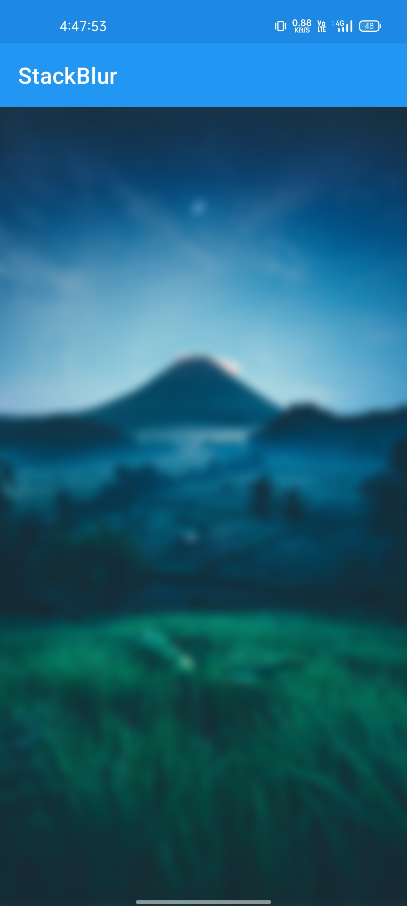

# StackBlur
[](https://github.com/RohitVermaOP/StackBlur)
[](https://jitpack.io/#RohitVermaOP/StackBlur)
[](./LICENSE)

Simple library which Blur bitmaps native Way

## Screenshot



## Download 

Add to project's build.gradle
```
maven { url 'https://jitpack.io' }
```

Add to module-level build.gradle
```
implementation 'com.github.RohitVermaOP:StackBlur:<latest-version>'
```

## Usage

Method 1
```java
// StackBlur#blurBitmap
Bitmap bitmap = BitmapFactory.decodeResource(getResources(), R.drawable.sample_img);
blurImageView.setImageBitmap(StackBlur.blurBitmap(bitmap, 40));
```
OR

Method 2
```java
// StackBlur#blurBitmap2 method suports multi thered and faster
Bitmap bitmap = BitmapFactory.decodeResource(getResources(), R.drawable.sample_img);
blurImageView.setImageBitmap(StackBlur.blurBitmap2(bitmap, 40));
```

## Developer

Developed by ```Rohit Verma```
+ [Instagram](http://instagram.com/mr_rohitverma88)
+ [Telegram](http://t.me/RohitVerma88)

## Thanks to
- [DrKLO](https://github.com/DrKLO) for the awesome [Telegram](https://github.com/DrKLO/Telegram)
- [Kikoso](https://github.com/kikoso) for the [android-stackblur](https://github.com/kikoso/android-stackblur)

## License
```
StackBlur is free software: you can redistribute it and/or modify
it under the terms of the GNU General Public License as published by
the Free Software Foundation, either version 3 of the License, or
(at your option) any later version.

StackBlur is distributed in the hope that it will be useful,
but WITHOUT ANY WARRANTY; without even the implied warranty of
MERCHANTABILITY or FITNESS FOR A PARTICULAR PURPOSE.  See the
GNU General Public License for more details.

You should have received a copy of the GNU General Public License
along with StackBlur.  If not, see <https://www.gnu.org/licenses/>.
```
